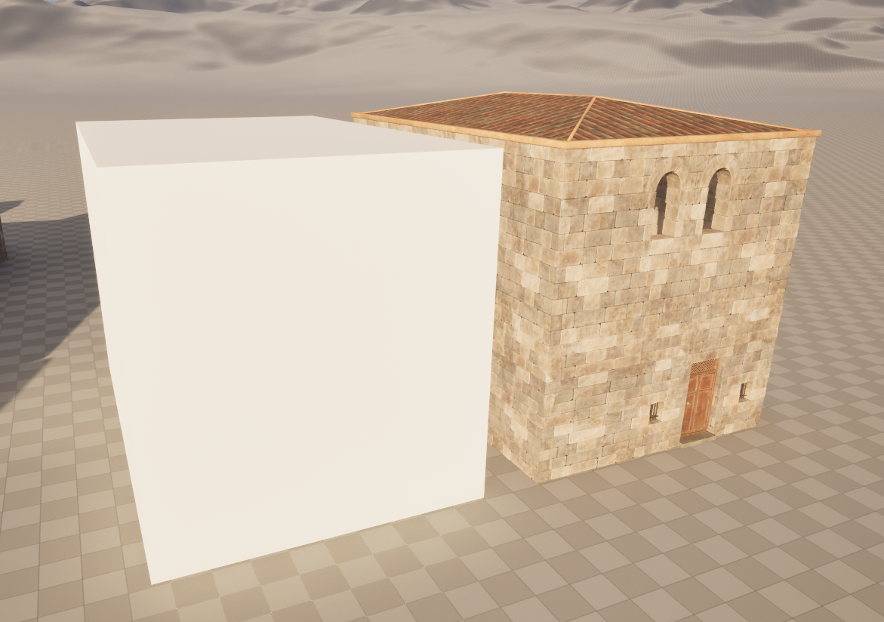
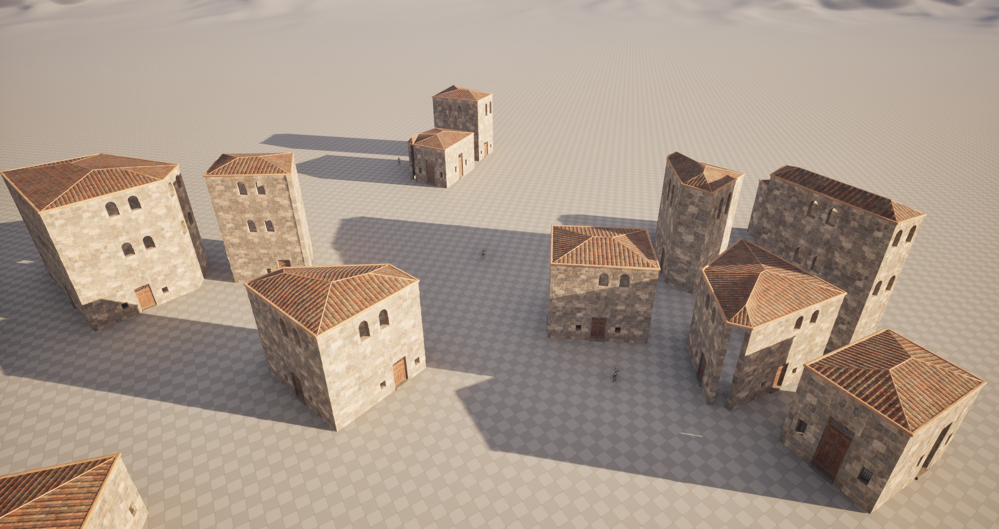

# What is BuildingGen?

BuildingGen is a straightforward building generator that assembles predefined modules to create simple structures, using nothing more than a basic box as input.

## What can it do for you?

The concept of BuildingGen is to offer a quick and easy solution for generating a variety of distinct building designs with minimal effort. While it’s not intended to produce AAA-quality or 'hero' buildings, it serves as a foundation that can be enhanced by adding decorative elements or other details to refine the basic structures.

