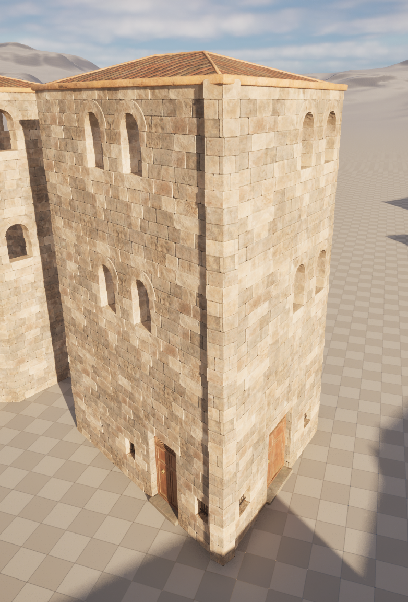

# Preparing your assets

## What works best?

The way the wall placing logic works makes it alsmost necessary to use thin, plane-like, geometry for the walls. This makes sure that you don't get clipping problems in the corners of your buildings.

These are just basic examples. You can still incorporate some thickness in the windows; however, the key point is to ensure that the edges remain narrow, where the walls will eventually meet.

Shapes like this would technically work, but I wouldn’t recommend using them, as they introduce other issues, such as ensuring precise cuts to avoid clipping and many other complications.

## Orientation and Pivot Point

> [!Warning]
> **This is the most crucial step. If you ignore it, your wall placement will be chaotic and misaligned.**

The pivot should be positioned precisely at the front right corner, as shown in the images. This pivot, combined with the asset length, will determine the placement of the walls.

If you notice any gaps or overlapping walls, be sure to check the pivot point.

If the orientation seems of, try to rotate the asset. 

## Size of the modules

Please maintain consistent module sizes across all assets, such as doors, walls, and windows. This uniformity is crucial for module placement. While height and width can vary—for example, a wall measuring 2 meters wide and 3 meters tall is acceptable—avoid mixing assets that have different dimensions.

