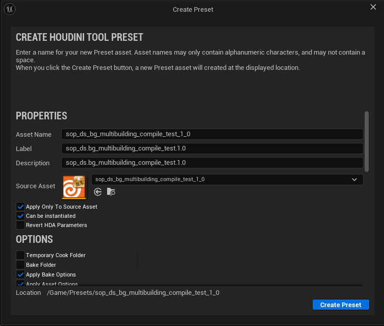
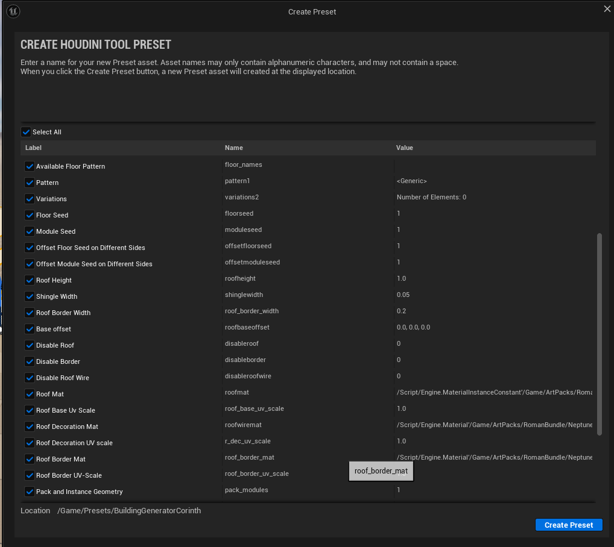
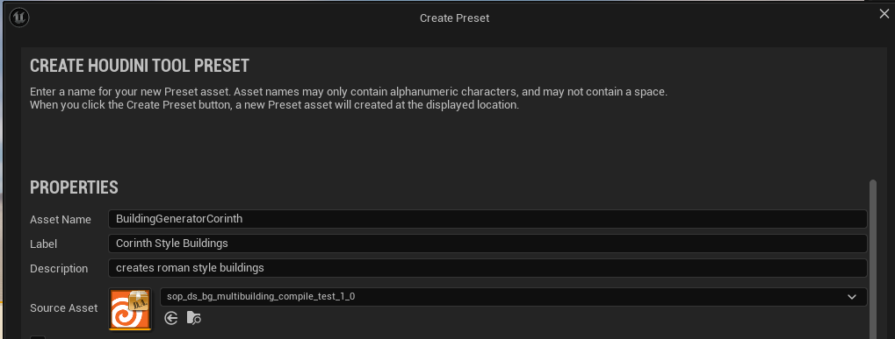

# Overview Parameters
 >On this page you can find all the available inputs for BuildingGen and what they do.

## Houdini Engine 
|    Parameter   |        Description    |  
| ------------- | :----------- | 
|Recook | When you recook an asset, the HDA processes and updates whether you made changes or not in the parameters. The term cooking is the same concept as in Houdini. The outputs of the HDA are recalculated when the cook is triggered. To see changes to your inputs and parameters within Unreal, you have to recook the asset. |
|Rebuild|When you rebuild, the asset gets recooked and also reimports the HDA. This is useful when you have made changes in Houdini to your HDA and you want the new inputs or parameters to appear.|
|Bake assets|When you bake an asset, this creates an Unreal asset or actor from your HDA. The original HDA remains unchanged but the new Unreal asset or actor is no longer connected to the HDA and all of its parameters. This new Unreal asset or actor no longer requires the Houdini Engine for Unreal to function.|

## Presets

You can use the gear icon in the HDA Details Panel to create some presents. A preset saves the current state of the HDA, and allowes you to use that exact state on other boxes.

Naming example

## Greybox Input

Geometry that will be used as the base for the building. 

Possible Inputs are:
|    Parameter   |        Description    |  
| ------------- | :----------- | 
|Geometry | Select a Static Mesh from the Asset Browser as Input. |
| World Select   |   Select a Static Mesh in your Scene as Input. |
|Curve Input| Input a Curve from the Asset Browser - not relevatent for this Tool, so **doesn't work**. |

> [!Tip]
> Using World Select is the preferred method. This also lets you change the size of the inputbox and see the result in realtime.

## Pattern

|    Parameter   |        Description    |  
| ------------- | :----------- | 
 Random Fill Patterns (Button) | Populates the Pattern field with random available floor patterns. |
  Show Floors (Button)  |   Shows a list with all available floor patterns, defined in the floor pattern Data Table. |
| Available Floor Pattern | Shows all available floor patterns (press Show Floors to show).|
|Pattern| The floor pattern that will be used to create the building.|
| Variations | Adds variation to the floors of the building, inputs are just available floor pattern (Use '+' to add variations).|
| Weight | How likely the variation will spawn, higher number = more likely.|
| Floor Seed | randomize the placement of the floor variations. |
| Module Seed | randomizes the placement of the modules within the bounds of a floor pattern (doens't seem to work right now so can be ignored). |
| Offset Floor Seed on Different Sides | If checked all sides of the building can be assigned a different floor type.   If unchecked all sides will be the same. |
| Offset Modules Seed on Different Sides | Not exactly sure what this does, but I guess if you have module variations it will randomly select those.|

## Data Tables

| Parameter   |        Description    |  
| ------------- | :----------- | 
 DT Floors | Input the Data Table which holds the Floor information |
| DT Modules | Input the Data Table which holds the Module information |

> [!Important]
> The Data Tables **must** be setup in a very specific way for the tool to work. This is defined by the structure asset in Unreal. More information about Data Tables can be found [here](./add-new-items.md).

## Structure

> [!Info]
> Not directly an available Parameter to change, but for sake of capturing every detail, Structs will be explained below.

Structs are needed to tell the Data Table what kind of information it holds. (Datatypes etc.)

| Parameter   |        Description    |  
| ------------- | :----------- | 
 ST_Floors | Structure used for the creation of the floor patterns.   Contains: FloorName (String), Pattern(String), CornerPiece(String), Height (Float) |
| ST_Meshes | Structure used for the Data Table that holds information about the Modules.   Contains: Model (Static Mesh), Name (String), Size (Float)|

> [!Important]
> If you want to create the Structs and Data Tables yourself, make sure to keep the order and naming exactly the same as in the screenshots provided.

## Roof

| Parameter| Description|
|---|:---|
| Roof Height | Sets the height of the roof (in meter) |
|Shingle Width| Adjust the width of the border on the roof|
|Roof Border Width| Adjusts the width of the border around the roof|

| Parameter   |        Description    |  
| ------------- | :----------- | 
| Base Offset | Translates the roof in x y or z direction if needed |
| Disable Roof | If checked disables, the roof|
| Disable Border | If checked disables, the border around the roof|
| Disable Roof wire | If checked, disables the 'wire' on the roof itself|

### Roof Materials

| Parameter   |        Description    |  
| ------------- | :----------- | 
| Roof Mat | Set the material of the Roof |
| Roof Base Uv Scale | Scales the UVs of the roof in x & y|
| Roof Decoration Mat | Set the material of the roof wire |
| Roof Decoration Uv Scale | Scales the UVs of the roof wire in x & y|
| Roof Border Mat | Set the material of the border around the roof |
| Roof Base Uv Scale | Scales the UVs of the roof in x & y|

## Common Settings

|Parameter | Description|
|---|---|
|Pack and Instance Geometry| Packs and Instances the Geometry, can be beneficial for performance|
|Disable Walls |If checked, disables the walls|
