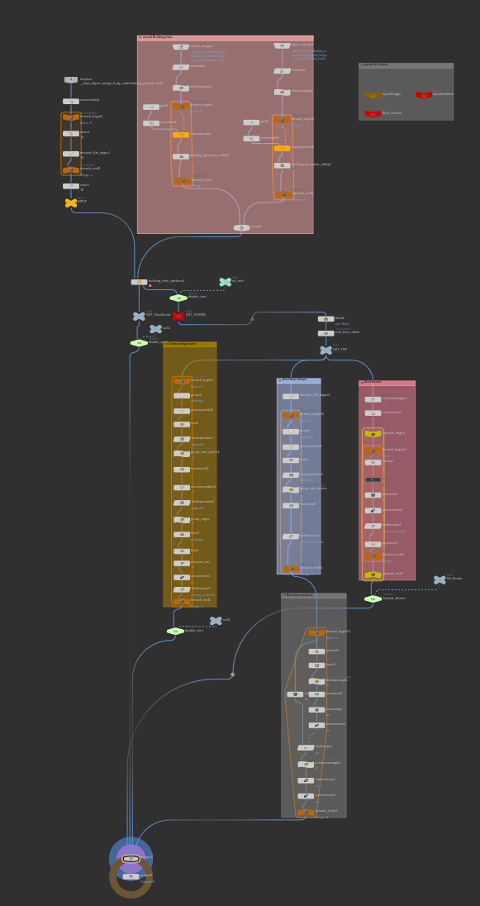
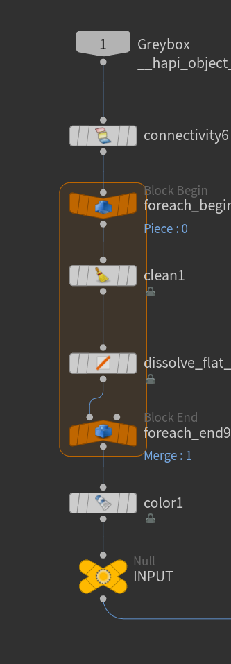
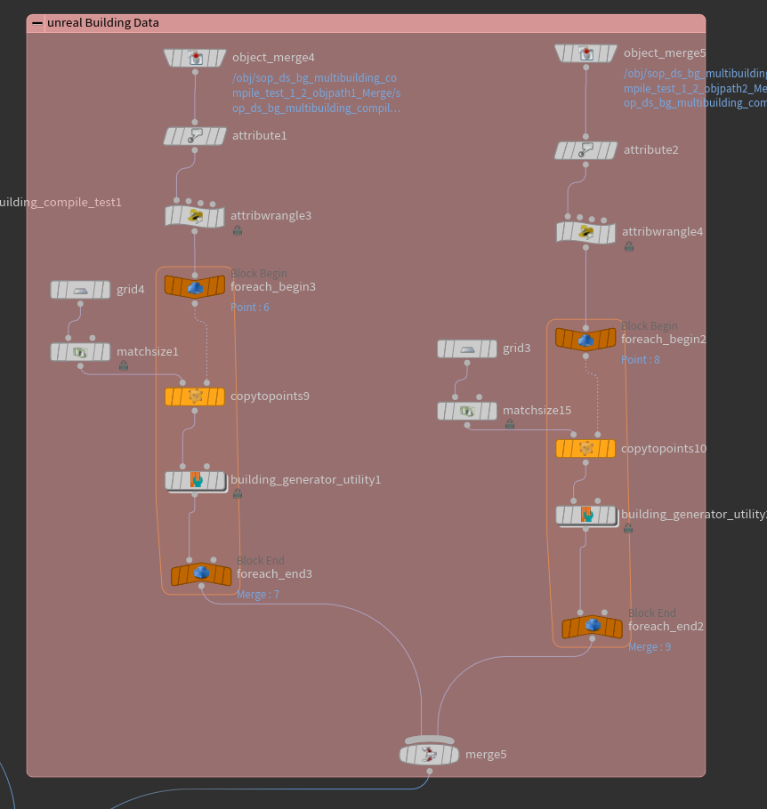
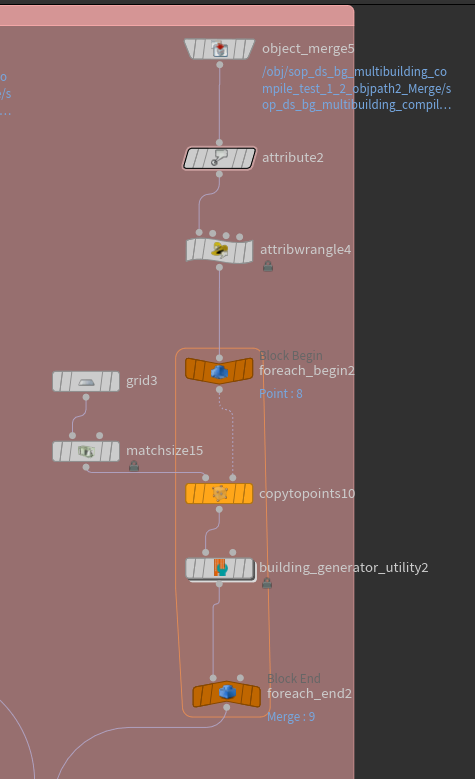
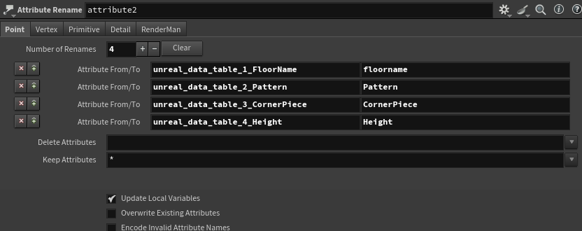

# Houdini Setup

The Houdini setup for BuildingGen will be explained below. This is intended for those interested in how it works, but it is not necessary for using the tool.

## The Node Tree

## Inputs

The first input is responsible for the box, which is used to generate the building. The other two inputs are used to import and store data from the Modules and Floor Data tables within Unreal.
|Box Input|Data Table input (object merge nodes at the top|
|---|---|
|| |

### Box Input Preperation

The boxes need to be prepared before they can be used in the system. This involves using a "for each" loop to iterate over each connected piece. During this process, all attributes are cleaned, and the flat edges are removed, effectively eliminating the triangulation from the boxes.

### Data Table Input

The default system in Houdini directly defines the assets, which can make it difficult or impossible for other artists to incorporate their own assets. Instead of relying on predefined assets, we propose allowing users to add their own. A Data Table is an effective solution for this, enabling users to append data to both tables and seamlessly integrate as many modules and floors as needed.

The following section explains how data input for the floors is managed, with a similar process applicable to the modules.

The object merge is responsible to get the data from the Floor Data Table. We then use an attribute rename, to rename the strings, because they come in a very unconvenient format out of Unreal.

## Generel Information

The key components driving this project are the Labs Building from Pattern and the Labs Building Generator Utility nodes. 

A detailed guide on how they work was already explained on the "how it works" section [here](./how-it-works.md)

### Labs Building from Patterns

*Creates buildings from blockout geometry defined by a pattern of floor modules.*

This node defines building patterns using Floor Descriptions generated by Labs Building Generator Utility nodes. These patterns can be repeated or occur at set intervals along each floor, defining the building style from the ground up.

https://www.sidefx.com/docs/houdini/nodes/sop/labs--building_from_patterns-1.0.html

### Labs Building Generator Utility

*Create base modules to use with the building generator, as well as override base module behavior.*

The gamedev building generator requires collections of named geometry. These collections are named 'wall', 'corner', 'top_ledge', and are referred to as modules. This node assists in the creation of these modules.

https://www.sidefx.com/docs/houdini/nodes/sop/labs--building_generator_utility.html

