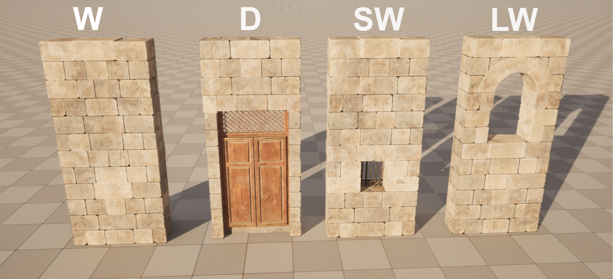

# How it works or understanding the 'grammar'

|Module|Name|
|---|---|
|Wall|W|
|Door|D|
|Small Window|SW|
|Large Window|LW|

Floors are generated using what’s known as a "pattern." A pattern is essentially a string that includes the name you assigned in the Module-Data Table, along with special characters. These characters indicate how frequently the module should appear or where it should be placed on the floor.

As an example we use those four modules from the image. Each module was assigned a name in this case just some letters to keep everything short. We try to create this floor pattern.

Upon closer inspection, you'll notice that we used three out of the four available modules, with one module (the walls) appearing twice. This floor layout can therefore be broken down as follows:

To create and apply this pattern, you simply need to add a row to the floor Data Table and select in the pattern section in the HDA-Details Panel. It will look like this:

(Note: The fields for CornerPiece and Height are left empty for demonstration purposes. For more details on Data Tables, refer to this [guide](add-new-items.md)).

## Special characters aka *the syntax*

When defining the floor string and entering the floor name in the pattern field, we used special characters to specify how many of each module (or in the case of floors, how many times a floor should be placed). The syntax is simple and straightforward:

|Character|Description|
|---|---|
|<  >|Repeat until you run out of space|
|[  ]|Place exactly one, or use []2, to place exactly 2 etc.|
| - | Used to alternate between two or more modules. (E.g. A-B = ABAB etc.)|
|*|Use variations of this Asset.  If you have for example different window types you can use Window* to indicate that you want to also use those variations.|

> [!Important]
> You cannot rely solely on square brackets [] when building your floor. For instance, if you write [wall], the system will attempt to place exactly one wall. But if your box is 10m wide and your wall is only 2m, this won’t work as expected. When using only one module, it must be enclosed in angle brackets <>. If you're using multiple modules, at least one of them needs to be written with angle brackets to ensure a proper working system.

> [!info]
> If you include only one floor type, you must enclose it in <> brackets when entering it in the pattern field. Failing to do so will prevent the system from correctly processing the floors when you scale the input cube larger than a single floor.

## Example with 2 different floors

For this example I created two new Floors in the Floor Data Table. I also increased to size of the building to show the behavior of the the floors using the [] and <> brackets.

The result is this building.

Note how the use of brackets influences floor placement. Square brackets [] mean "place exactly one," so no matter how large the building is scaled, the GroundFloor will always be placed at the bottom. The remaining space is filled with FirstFloor elements, as they are enclosed in angle brackets <>, allowing for flexible placement based on the size of the building.
> [!info]
> If you change the Data Tables, you have to Rebuild the asset so the changes will be visisble.

## The generic floor type

The generic floor type is a built-in example from the system that generates the walls. You can safely ignore it.

## Fixing problems

If you encounter any issues with the modules and patterns, first check for typing errors and then try rebuilding the asset. Typing errors and incorrect syntax are the most common problems encountered.