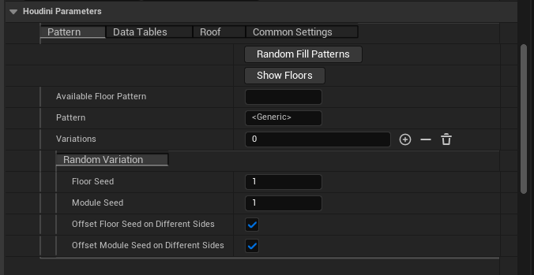
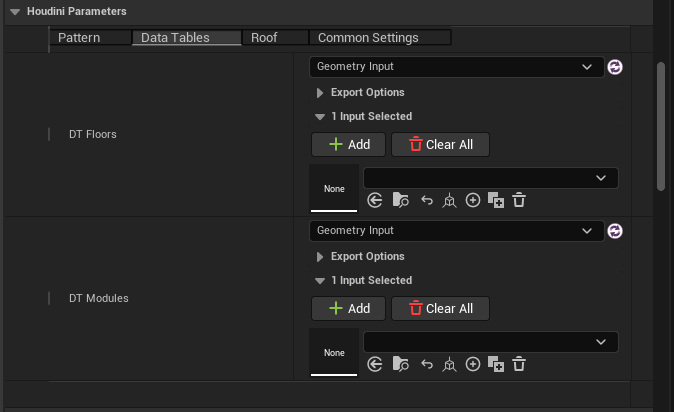
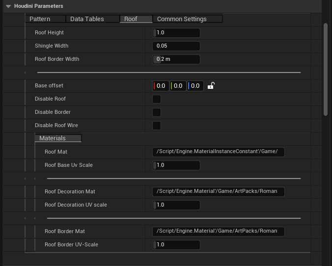
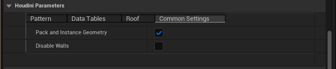

# Quickstart Guide
> [!info]
> If you change the Data Tables, or something else and the tool doens't seem to work anymore, you have to Rebuild or Recook the asset.

## 1. Houdini Session
- Start a Houdini Session by using the Houdini Engine Tab.

## 2. Add HDA to Scene
- Drag the HDA from the Asset Browser into your Unreal Scene, where exactly doesn't matter.

## 3. Fill the HDA with Data

Make sure to add the floor and module Data Tables to the HDA.

- Select a Greybox in your scene for the Geometry Input

> [!Tip]
> Using World Inputw is the preferred method. This also lets you change the size of the inputbox and see the result in realtime.

- Choose a Floortype from the list.

## 4. Short interface overview

**Pattern:**
Select the pattern used for creating the building.

**Data Tables:**
Add the Data Tables that hold the information about floors and modules.

**Roof:**
Parameters for setting the roof size and material.

**Common Settings:**
Settings that didn't fit the other criteria.

## 5. More information 

A list of all available parameters and what they do can be found [here](./hda-parameters).

## 6. Further helpful guides: 

- [Understanding how patterns work](./how-it-works.md).
- [Adding new content](./add-new-items.md).